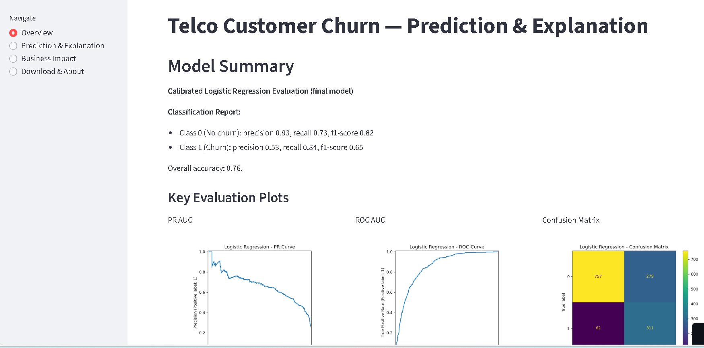
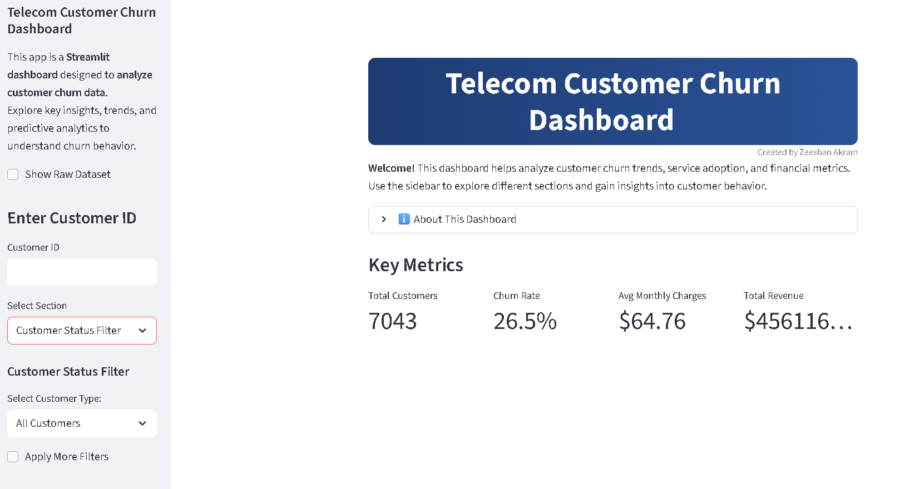
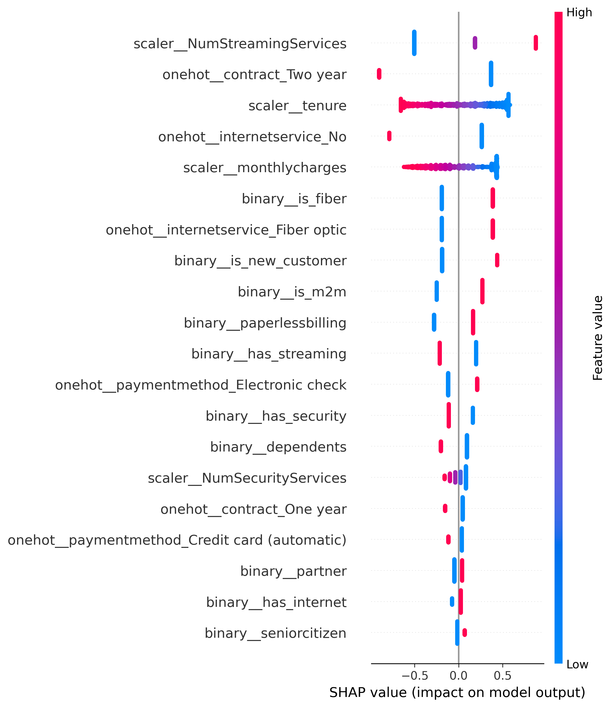

# Customer Churn Prediction & Dashboard

## Project Overview / Description
This project develops a robust solution to predict customer churn in the telecommunications industry, enabling businesses to proactively retain customers and minimize revenue loss. Leveraging machine learning, it provides actionable insights through a live prediction Streamlit app and a comprehensive dashboard. The solution helps identify at-risk customers, optimize retention strategies, and save significant revenue by reducing churn-related losses, estimated at $500 per lost customer.

## Problem Statement
Companies frequently face revenue declines due to unexpected customer churn. The challenge is to predict churn before it occurs, offering businesses actionable insights to retain customers and mitigate financial losses. This project addresses this by building a predictive model and interactive tools to support data-driven decision-making.

## Dataset
- **Source**: [Telco Customer Churn Dataset](https://www.kaggle.com/datasets/blastchar/telco-customer-churn) from Kaggle, comprising 7043 customer records from a telecommunications company.
- **Original Features**: Includes demographic details (`customer_id`, `gender`, `seniorcitizen`), account information (`tenure`, `contract`, `paperlessbilling`, `paymentmethod`), charges (`monthlycharges`, `totalcharges`), and services (`phoneservice`, `multiplelines`, `internetservice`, `onlinesecurity`, `onlinebackup`, `deviceprotection`, `techsupport`, `streamingtv`, `streamingmovies`).
- **Engineered Features**: Enhanced with custom features such as `is_new_customer` (tenure < 12 months), `is_m2m` (month-to-month contract), `has_streaming` (presence of streaming services), `has_security` (presence of security services), and `is_fiber` (Fiber Optic internet service), derived to capture churn drivers.
- **Target**: Churn (0 = No churn, 1 = Churn), with a 26.5% churn rate, indicating a moderately imbalanced dataset.

## Exploratory Data Analysis (EDA)
- **Comprehensive Analysis**: Conducted an extensive exploratory data analysis to uncover underlying patterns and drivers of customer churn, utilizing statistical tests, visualizations, and feature importance assessments.
  - **Univariate Insights**: Examined distributions of key variables such as `tenure` (right-skewed with a peak at 0-10 months), `monthlycharges` (concentrated at $60-80 for churned customers), and `totalcharges` (lower for churners due to shorter tenure). A Mann-Whitney U test confirmed significant differences in tenure between churned and retained customers (p-value = 2.42e-208).
  - **Bivariate Relationships**: Identified strong correlations, notably between `tenure` and `totalcharges` (0.83), and a negative correlation between `tenure` and churn (-0.35), suggesting longer tenure reduces churn likelihood. Scatter plots and box plots highlighted higher `monthlycharges` ($80 vs. $60) as a churn risk factor.
  - **Categorical Analysis**: Analyzed churn rates across categorical features, revealing high churn among Fiber Optic users (70.3%), month-to-month contract holders (43%), and those using Electronic Check (45%). In contrast, two-year contract customers exhibited a mere 3% churn rate, while No Internet service users showed stability (19% to 0% churn). Chi-square tests indicated no significant churn association with `gender` (p = 0.49) or `phoneservice` (p = 0.34).
  - **Segmented Trends**: Explored monotonic and segmented patterns, noting churn decreases with tenure (48% at 0-12 months to 2% at 72+ months). Segment analysis highlighted Fiber Optic users as high-risk (70.3% at 0-12 months) compared to DSL (41%), and month-to-month contracts as risky (52% at 0-12 months) versus two-year (0%). Service add-ons like `onlinesecurity` reduced churn, while `streamingtv` increased it.
- **Visualization & Feature Selection**: Leveraged histograms, correlation heatmaps, and Mutual Information (MI) scores to guide feature engineering and selection. Dropped low-impact features (`customer_id`, `gender`, `phoneservice`, `multiplelines` with MI < 0.0008) and used Variance Inflation Factor (VIF) to exclude `totalcharges` (VIF = 9.39) due to multicollinearity. Top MI features included `contract` (0.098) and `tenure` (0.082), shaping the modeling approach.
## Model Building
- **Models Explored**: Conducted a thorough evaluation of multiple machine learning algorithms to predict customer churn, including Logistic Regression, Random Forest, XGBoost, Gradient Boosting, LightGBM, CatBoost, Support Vector Classifier (SVC), K-Nearest Neighbors (KNN), Voting Classifier, and Stacking Classifier. Initial experiments were performed on both raw and grouped datasets to assess performance across diverse approaches.
  - **Baseline Models**: Started with untuned models like Random Forest (0.78 accuracy, 0.51 recall) and Logistic Regression (0.79 accuracy, 0.52 recall) to establish a performance benchmark.
  - **Tuning & Optimization**: Applied hyperparameter tuning using Optuna with a recall-focused objective, enhancing models like Logistic Regression (0.84 recall, 0.61 F1) and SVC (0.79 recall, 0.61 F1). Techniques such as SMOTE addressed the 26.5% class imbalance, boosting recall to 0.60 for Logistic Regression.
  - **Advanced Techniques**: Explored polynomial features, calibration with CalibratedClassifierCV, and ensemble methods (Voting and Stacking) to improve robustness. Ensembles achieved up to 0.75 recall but added complexity without significant gains over tuned Logistic Regression.
- **Final Model**: Selected Calibrated Logistic Regression with SMOTE and engineered features (`is_new_customer`, `is_m2m`, `has_streaming`, `has_security`, `is_fiber`) as the optimal choice. This model was favored for its balance of interpretability, computational simplicity, and strong business-aligned performance, validated through cross-validation and cost-sensitive evaluation.
  - **Training Process**: Utilized stratified 5-fold cross-validation to ensure robustness, with custom F1 scoring at the 0.28 threshold (mean F1 = 0.6184, std = 0.0241) aligning with test results (0.65 F1).
  - **Threshold Optimization**: Identified 0.28 as the business-optimal threshold, balancing recall (0.84) and precision (0.53), while a 0.03 threshold maximized net gain ($57,760) with 0.99 recall.
- **Performance Metrics**: 
  - Accuracy: 0.76
  - Precision: 0.53
  - Recall: 0.84
  - F1 Score: 0.65
  - ROC-AUC: 0.86
  - Average Precision: 0.67
  - **Cost Metrics**: At 0.28 threshold, net gain of $27,040 for 1409 customers ($191,900 for 10K), with TP gain of $62,600, FP cost of $5,560, and FN cost of $30,000. At 0.03 threshold, net gain peaks at $57,760 with 370 TPs and only 3 FNs.

## Feature Importance / Explainability
- Key features driving churn include `is_fiber` (0.65 impact), `is_m2m` (0.54), and `NumStreamingServices` (0.67), while `NumSecurityServices` (-0.09) reduces churn risk.
- SHAP analysis provides detailed insights into individual predictions, visualized via waterfall plots to explain why a customer is likely to churn or stay.

## Streamlit Apps
### Live Prediction App
- **Link**: [https://churn-prediction-model-boafapprtqcjnhgxsft5kem.streamlit.app/](https://churn-prediction-model-boafapprtqcjnhgxsft5kem.streamlit.app/)
- **Description**: Allows users to input customer details (e.g., tenure, contract type, services) and get real-time churn predictions with confidence scores. Features a slider to adjust thresholds (default 0.28) and a SHAP waterfall plot for interpretability. Recommended actions are suggested based on predictions.
- **Screenshot**: 

### Dashboard App
- **Link**: [https://customer-churn-dashboard-ogznspbcvurphc9qkjmahz.streamlit.app/](https://customer-churn-dashboard-ogznspbcvurphc9qkjmahz.streamlit.app/)
- **Description**: Offers visual analytics including churn distribution histograms, violin plots of monthly charges vs. churn, scatter plots of tenure vs. total charges, bar charts for payment methods and contract types, and KPI cards for financial metrics. Supports customer search, demographic analysis, and service adoption trends.
- **Screenshot**: 

## Installation / How to Run
1. **Clone the repository**:
- git clone https://github.com/zeeshan-akram-ds/customer-churn-project.git
2. **Install requirements**:
- pip install -r requirements.txt
3. **Run Streamlit app**:
- streamlit run app.py

## Business Impact / Conclusion
- This project enables businesses to proactively retain high-risk customers, reducing churn-related revenue loss by up to $191,900 per 10,000 customers with the 0.28 threshold model.
- The 0.03 threshold model offers a maximum net gain of $57,760, ideal for maximizing recall (0.99) despite higher false positives.
- Insights from SHAP and the dashboard support targeted marketing and retention campaigns, enhancing customer lifetime value.

## Future Work
- Deploy the apps on cloud platforms like AWS or Heroku for broader access.
- Integrate real-time data updates for dynamic predictions.
- Try more techniques and feature engineering to improve performance.
- Build Power BI interactive Dashboard.
## References / Resources
- Dataset: Adapted from Kaggle (Customer Churn Dataset).
- Libraries: Scikit-learn, SHAP, Streamlit, Plotly, Pandas.
- Tutorials: Streamlit documentation, SHAP GitHub repository.

---

